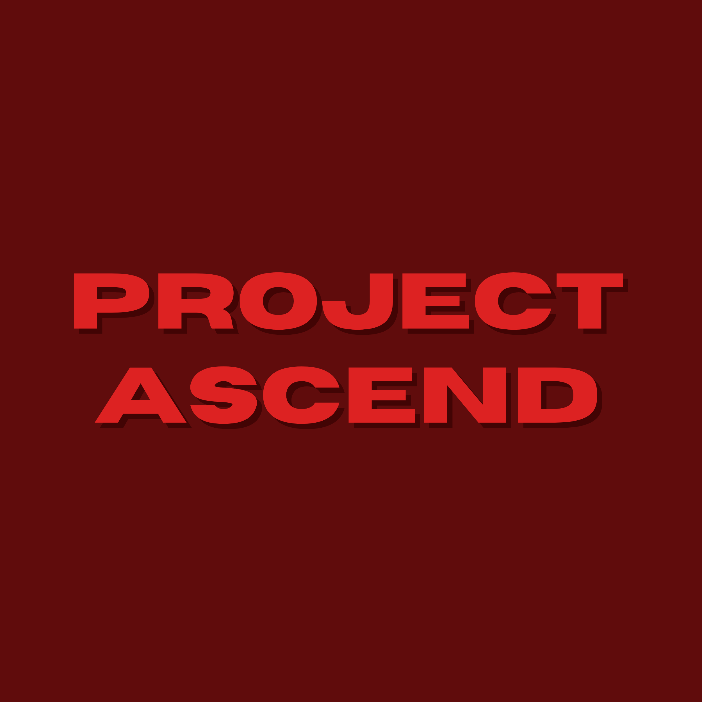
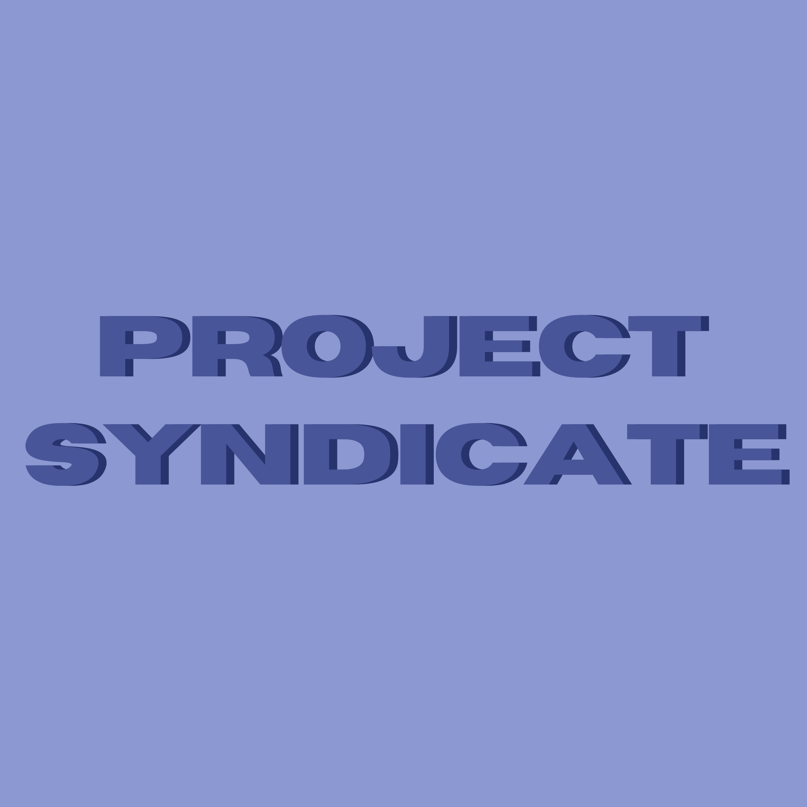
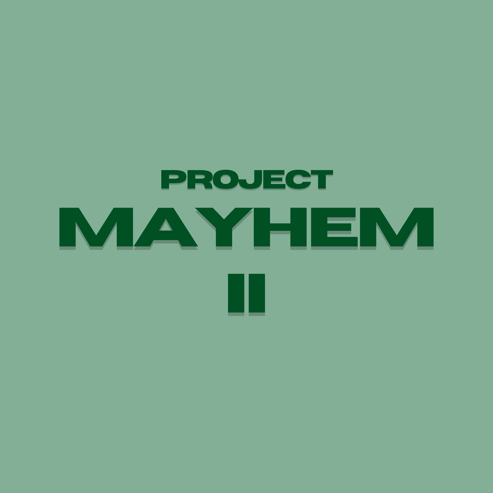

Also known as PM from back when we were secretive about it.

Project Mayhem was the first project I ever started, and it was also a self improvement Project. The main goal was improving myself and my life to be able to get a girlfriend, but then shifted more to helping others and myself out of bad mental places. We had a couple meetings, some documentation I made, a public instagram self improvement account (Quill Shotwell), and a couple other stuff. More than 95% of work was done by myself.

Project Mayhem was a project with a focus on community. Members would post their daily difficulties and successes, as well as notation for everyone to see. This would promote a kind of "familiar" relationship to other members, as well as open yourself up for support and advice from others, and vice-versa.

There was a role system that kept growing. At the beginning it was just me (the admin) and the other members, then the lowest member role was named Consignee, and mine was named Major. There were also a couple higher up roles towards the end, though no one was able to reach the next other than myself and an ex-friend of mine, and the last stayed unacquired. There was an estimate of about 8 Majors in the span of Project Mayhem, who all served to fill a kind of "elder" role, warming up newcomers when we got any. At the height of the project, there were about 30 people.

Shortly after, I got tired of doing all the work myself without any exterior support so I left Project Mayhem to start Project Ascend, a stricter alternative.

---

##### Project Ascend

Project Ascend was supposed to be stricter, so less people came in. I was honestly a bit desperate to actually make a change in my life and people around me were not following with the same pace, so this didn't take too long to be closed for Project Syndicate as well. I don't have anything to say about Syndicate, as it suffered the same fate before Project Mayhem II returned as another alternative which was supposed to be *less* strict and difficult to follow, but by then people had lost the last bit of motivation and most mayhemees didn't even return.

Here's the banner for Mayhem II as well, just for preservation purposes.

##### Project Star

After eventually getting tired of being let down by others who weren't on the same path as I am (which is understandable, but I was stupidly trying to make the incompatibilities work) I eventually came to make Project Star, which was a "solo" project. I say that because every time I'm happy being solo someone new comes along who I think I could try and recruit but they're a let down each time. And with each I mean just two times. But you'll learn more about that in the Project Star designated post.

##### Collaboration

Project Mayhem has ended, however if I get enough people in the far future and get the crazy idea of making a third project mayhem, then sure. You know where to contact me if you're interested.